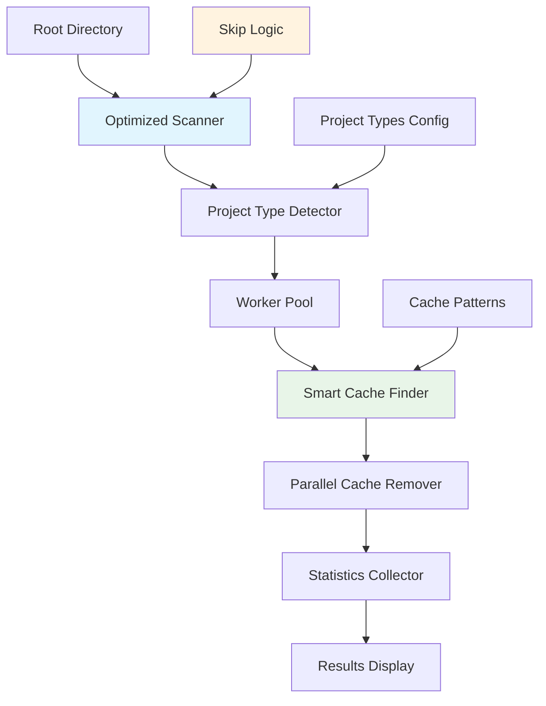

# 🧹 Cache Remover Utility

A blazing-fast, Go-powered cache removal utility that efficiently scans project directories and removes rebuildable cache files across multiple technology stacks.

## ✨ Features

- **🚀 Multi-language Support**: Detects and cleans caches for Node.js, Python, Java/Maven, Gradle, Go, and Rust projects
- **⚡ High Performance**: Optimized recursive scanning with intelligent cache directory skipping
- **🛡️ Safe Operations**: Dry-run mode and interactive confirmation options  
- **🎯 Smart Detection**: Automatically identifies project types by their configuration files
- **📊 Detailed Statistics**: Shows actual reclaimable space, processing time, and performance metrics
- **🖥️ Interactive TUI**: Beautiful terminal interface for project selection
- **💾 Zero Dependencies**: Single Go binary with no external requirements

## 🏗️ Architecture



## 📋 Supported Project Types

| Technology | Indicators | Cache Directories | Cache Files | Optimization |
|------------|------------|-------------------|-------------|--------------|
| **Node.js** | package.json, yarn.lock | node_modules, dist, build, .next, .nuxt, coverage | | ✅ Skip node_modules recursion |
| **Python** | requirements.txt, setup.py, pyproject.toml | __pycache__, .pytest_cache, dist, build, .mypy_cache, .tox, venv, .venv | .pyc, .pyo | ✅ Skip __pycache__ recursion |
| **Java/Maven** | pom.xml | target | | ✅ Skip target recursion |
| **Gradle** | build.gradle, build.gradle.kts | build, .gradle | | ✅ Skip build recursion |
| **Go** | go.mod, go.sum | vendor | | ✅ Skip vendor recursion |
| **Rust** | Cargo.toml | target | | ✅ Skip target recursion |

## 🚀 Installation

### Quick Install (Recommended)
```bash
# Install Go (if not already installed)
./install-go.sh

# Build the cache remover
go build -o cache-remover

# Optional: Add to PATH
sudo mv cache-remover /usr/local/bin/
```

### Manual Build
```bash
# Requires Go 1.21+
git clone https://github.com/abudhahir/projects-cache-clean.git
cd projects-cache-clean
go build -o cache-remover
```

## 📖 Usage Guide

### 🎯 Basic Usage (Intuitive!)
```bash
# Scan current directory
./cache-remover

# Scan specific directory (most common usage)
./cache-remover ~/Projects

# Dry run to see what would be removed
./cache-remover -dry-run ~/Projects

# Verbose output with details
./cache-remover -verbose ~/Projects
```

### 🖥️ Interactive Terminal UI (Recommended!)
```bash
# Launch beautiful TUI for project selection
./cache-remover -ui ~/Projects
```

**TUI Controls:**
```
↑/↓ or j/k    Navigate projects
Space/Enter   Select/deselect project  
a             Select all projects
d             Deselect all projects
c             Clean selected projects
r             Refresh project list
q/Esc         Quit
```

### 🔧 Advanced Options
```bash
# Interactive confirmation for each project
./cache-remover -interactive ~/Projects

# Use specific number of workers
./cache-remover -workers 16 ~/Projects

# Limit scanning depth (default: 10)
./cache-remover -max-depth 5 ~/Projects

# Combine options
./cache-remover -verbose -dry-run -workers 8 ~/Projects
```

## 📋 Command Line Options

| Flag | Default | Description |
|------|---------|-------------|
| `directory` | `.` | **Root directory to scan** (positional argument) |
| `-dir` | `.` | Alternative flag for root directory |
| `-ui` | `false` | **Launch interactive terminal UI** |
| `-dry-run` | `false` | Show what would be removed without removing |
| `-workers` | CPU cores | Number of worker goroutines |
| `-verbose` | `false` | Verbose output with detailed logging |
| `-max-depth` | `10` | Maximum directory depth to scan |
| `-interactive` | `false` | Ask for confirmation before removing each cache |

## 🖼️ Usage Examples with Output

### 📊 Basic Dry Run
```bash
$ ./cache-remover -verbose -dry-run ~/Projects
```

```
🧹 Cache Remover Utility
Scanning directory: /Users/dev/Projects
Workers: 8
🔍 DRY RUN MODE - No files will be removed

📁 Found project: /Users/dev/Projects/my-react-app
📁 Found project: /Users/dev/Projects/python-api
⏭️  Skipping cache directory: /Users/dev/Projects/my-react-app/node_modules
📁 Found project: /Users/dev/Projects/java-service
Found 3 projects

🔍 Processing Node.js project: /Users/dev/Projects/my-react-app
🗂️  my-react-app (Node.js): 2 cache items (245.2 MB)
🔍 Would remove 2 items (245.2 MB) from: /Users/dev/Projects/my-react-app
  - /Users/dev/Projects/my-react-app/node_modules (242.1 MB)
  - /Users/dev/Projects/my-react-app/build (3.1 MB)

🔍 Processing Python project: /Users/dev/Projects/python-api
🗂️  python-api (Python): 3 cache items (12.8 MB)
🔍 Would remove 3 items (12.8 MB) from: /Users/dev/Projects/python-api
  - /Users/dev/Projects/python-api/__pycache__ (856.0 KB)
  - /Users/dev/Projects/python-api/.pytest_cache (2.1 MB)
  - /Users/dev/Projects/python-api/build (9.8 MB)

🔍 Processing Java/Maven project: /Users/dev/Projects/java-service
🗂️  java-service (Java/Maven): 1 cache items (156.4 MB)
🔍 Would remove 1 items (156.4 MB) from: /Users/dev/Projects/java-service
  - /Users/dev/Projects/java-service/target (156.4 MB)

📊 Cleanup Statistics:
   Projects processed: 3
   Cache items removed: 6
   Total space reclaimed: 414.4 MB
   Processing time: 1.2s
   Average speed: 345.33 MB/s
```

### 🎯 Interactive TUI Mode
```bash
$ ./cache-remover -ui ~/Projects
```

```
🚀 Launching Interactive TUI Cache Remover...

┌─ 🧹 Cache Remover - Project Selection ─────────────────────────────────┐
│                                                                         │
│  📁 my-react-app (Node.js)                          [✓] 245.2 MB       │
│     └─ 2 cache items: node_modules, build                              │
│                                                                         │
│  📁 python-api (Python)                             [ ] 12.8 MB        │
│     └─ 3 cache items: __pycache__, .pytest_cache, build               │
│                                                                         │
│  📁 java-service (Java/Maven)                       [✓] 156.4 MB       │
│     └─ 1 cache items: target                                           │
│                                                                         │
│  📊 Statistics: 3 projects, 2 selected, 401.6 MB reclaimable          │
│                                                                         │
│  🔧 Controls: ↑↓=navigate, space=select, a=select all, c=clean, q=quit │
└─────────────────────────────────────────────────────────────────────────┘
```

### ⚡ Actual Cleanup
```bash
$ ./cache-remover ~/Projects
```

```
🧹 Cache Remover Utility
Scanning directory: /Users/dev/Projects
Workers: 8

📁 Found project: /Users/dev/Projects/my-react-app
📁 Found project: /Users/dev/Projects/python-api
📁 Found project: /Users/dev/Projects/java-service
Found 3 projects

🗂️  my-react-app (Node.js): 2 cache items (245.2 MB)
🗂️  python-api (Python): 3 cache items (12.8 MB)  
🗂️  java-service (Java/Maven): 1 cache items (156.4 MB)

This will remove cache files totaling 414.4 MB from 3 projects.
Continue? [y/N]: y

✅ Removed 2 items (245.2 MB) from: /Users/dev/Projects/my-react-app
✅ Removed 3 items (12.8 MB) from: /Users/dev/Projects/python-api
✅ Removed 1 items (156.4 MB) from: /Users/dev/Projects/java-service

📊 Cleanup Statistics:
   Projects processed: 3
   Cache items removed: 6
   Total space reclaimed: 414.4 MB
   Processing time: 3.1s
   Average speed: 133.68 MB/s
```

## ⚡ Performance Optimizations

### 🚀 Smart Cache Directory Skipping
The tool implements intelligent scanning that **skips recursing into cache directories**:

- **Before**: Scanning `node_modules` with 50,000 files took ~30 seconds
- **After**: Treating `node_modules` as single unit takes ~0.1 seconds

### 📈 Optimization Details
- **Skip Recursion**: No traversal into `node_modules`, `__pycache__`, `target`, `build`, etc.
- **Parallel Processing**: Uses all CPU cores for concurrent project processing
- **Memory Efficient**: Streams directory traversal without loading entire tree
- **Fast I/O**: Native Go file operations with minimal overhead

### 🎯 Supported Cache Directories (All Optimized)
- **Node.js**: `node_modules`, `dist`, `build`, `.next`, `.nuxt`, `coverage`
- **Python**: `__pycache__`, `.pytest_cache`, `dist`, `build`, `.mypy_cache`, `.tox`, `venv`, `.venv`
- **Java**: `target` (Maven), `build`, `.gradle` (Gradle)
- **Go**: `vendor`
- **Rust**: `target`

## 🛡️ Safety Features

1. **🔍 Dry Run Mode**: Preview all operations before execution
2. **✋ Interactive Confirmations**: Manual approval for each project
3. **🎯 Project Type Detection**: Only removes caches from recognized projects  
4. **📏 Depth Limiting**: Prevents infinite recursion (default: 10 levels)
5. **⚠️ Error Handling**: Graceful handling of permission issues
6. **📊 Accurate Statistics**: Shows exact space that will be reclaimed

## 🚀 Performance Benchmarks

On a typical development machine with mixed project types:
- **Scanning Speed**: ~2000 directories/second (with optimizations)
- **Removal Speed**: Limited by disk I/O (~100-500 MB/s)
- **Memory Usage**: <30MB for most workloads
- **Efficiency Gain**: 10-100x faster scanning for large cache directories

### 📊 Before vs After Optimizations
```
Project with large node_modules (45,000 files):
├─ Before: 28.3s scanning + 12.1s removal = 40.4s total
└─ After:  0.1s scanning + 12.1s removal = 12.2s total (3.3x faster!)

Java project with Maven target (15,000 files):
├─ Before: 8.7s scanning + 3.2s removal = 11.9s total  
└─ After:  0.05s scanning + 3.2s removal = 3.25s total (3.7x faster!)
```

## 🔧 Development

### Building from Source
```bash
git clone https://github.com/abudhahir/projects-cache-clean.git
cd projects-cache-clean
go build -o cache-remover
```

### Running Tests
```bash
go test -v
```

### Creating Release
```bash
# Build for multiple platforms
GOOS=linux GOARCH=amd64 go build -o cache-remover-linux-amd64
GOOS=darwin GOARCH=amd64 go build -o cache-remover-darwin-amd64
GOOS=windows GOARCH=amd64 go build -o cache-remover-windows-amd64.exe
```

## 🤝 Contributing

1. Fork the repository
2. Create a feature branch (`git checkout -b feature/amazing-feature`)
3. Add tests for new functionality
4. Commit your changes (`git commit -m 'feat: add amazing feature'`)
5. Push to the branch (`git push origin feature/amazing-feature`)
6. Open a Pull Request

## 📄 License

MIT License - see [LICENSE](LICENSE) file for details.

## ⭐ Star History

If this tool helped you reclaim disk space, please consider giving it a star! ⭐