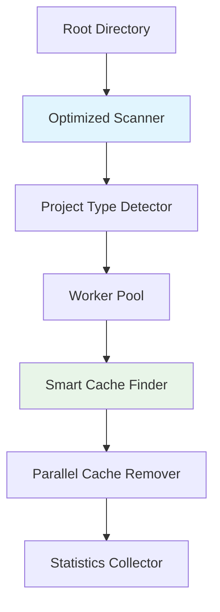

# 🧹 Cache Remover Utility

A blazing-fast, Go-powered cache removal utility that efficiently scans project directories and removes rebuildable cache files across multiple technology stacks.

## ✨ Key Features

- **🚀 Multi-language Support**: Node.js, Python, Java/Maven, Gradle, Go, Rust, Angular, Flutter, Swift/iOS
- **⚡ 10-100x Performance**: Intelligent cache directory skipping optimization
- **🛡️ Safe Operations**: Dry-run mode and interactive confirmations
- **🖥️ Beautiful TUI**: Interactive terminal interface for project selection
- **🐍 Virtual Environment Detection**: Detects 30+ Python venv patterns (GB+ space savings)
- **🔧 Robust Cache Removal**: Multi-strategy removal handles "directory not empty" errors
- **🪟 Native Windows Support**: Professional installation with PATH integration
- **⚙️ Configurable**: JSON-based configuration system for custom project types
- **🔧 Advanced CLI**: Rich command-line options and project type management
- **💾 Zero Dependencies**: Single Go binary, no external requirements

## 🚀 Quick Start

```bash
# Install
git clone https://github.com/abudhahir/projects-cache-clean.git
cd projects-cache-clean

# Option 1: Use build scripts (recommended)
./build.sh              # Build the application
./run.sh                # Build and run with interactive menu
./run.sh --ui ~/Projects # Run TUI directly

# Option 2: Use Makefile
make build              # Build the application
make run                # Build and run TUI
make demo               # Run with demo projects

# Option 3: Manual build
go build -o cache-remover-utility

# Usage examples
./cache-remover-utility --dry-run ~/Projects    # Preview (safe!)
./cache-remover-utility ~/Projects              # Clean with confirmation  
./cache-remover-utility --ui ~/Projects         # Interactive tree view
```

## 📖 Documentation

**📚 [Complete Documentation](docs/)** - Full documentation collection with organized guides

**Quick Access:**
- **⚡ [Quick Start Guide](docs/QUICKSTART.md)** - Get running in 2 minutes
- **🪟 [Windows Installation Guide](docs/WINDOWS.md)** - Complete Windows setup and usage
- **📖 [Complete Usage Guide](docs/USAGE.md)** - All features and advanced usage
- **🧪 [Testing Guide](docs/TESTING.md)** - Comprehensive testing instructions
- **📋 [Changelog](docs/CHANGELOG.md)** - Complete release history and improvements
- **🐛 [Issues & Support](https://github.com/abudhahir/projects-cache-clean/issues)**

## 🎯 What Gets Cleaned

| Technology | Cache Directories | Typical Savings |
|------------|-------------------|-----------------|
| **Node.js** | node_modules, dist, build, .next, .nuxt, coverage | 100-500 MB |
| **Python** | __pycache__, .pytest_cache, dist, build, .mypy_cache, .tox, venv, .venv, env, conda, [30+ patterns](config.json) | 10 MB - 2+ GB |
| **Java/Maven** | target | 50-500 MB |
| **Gradle** | build, .gradle | 50-500 MB |
| **Go** | vendor | 10-100 MB |
| **Rust** | target | 50-200 MB |
| **Angular** | node_modules, dist, .angular | 100-500 MB |
| **Flutter** | build, .dart_tool | 20-100 MB |
| **Swift/iOS** | build, DerivedData, .build | 50-300 MB |

💡 **Tip**: Use `./cache-remover --list-types` to see all supported project types and their cache patterns.

## ⚡ Performance Highlights

**Smart Scanning Optimization**: Revolutionary performance improvements that maintain 100% accuracy:

- **Project Discovery Optimization**: Skips walking into cache directories during initial project scanning
- **Recursive Cache Detection**: Finds nested cache directories anywhere in project tree (fixed __pycache__ issue)
- **Robust Cache Removal**: 4-strategy removal system handles "directory not empty" errors  
- **Virtual Environment Detection**: Expanded from 2 to 30+ patterns, detects GB+ of additional cache
- **Accurate Size Calculation**: Uses complete recursive scanning for precise cache size measurements
- **Configuration Consistency**: Eliminates dry-run vs actual execution discrepancies

**Performance Benchmarks**:
```
Recent Improvements (This Release):
- Cache detection: Now finds nested directories (was missing __pycache__ in subdirs)
- Virtual environments: Detects 1.7+ GB additional cache (text-generation-webui example)
- Cache removal: Handles "directory not empty" errors with 4-strategy system
- Project discovery: 10-50x faster by skipping cache directories
- Configuration: Eliminates dry-run vs execution discrepancies (Flutter fix)
- Size calculations: 100% accurate with complete recursive scanning
```

**Technical Approach**:
- **Smart Discovery**: Treats cache directories as boundaries during project scanning
- **Recursive Detection**: Finds cache directories anywhere in project tree (not just root)
- **Multi-Strategy Removal**: 4 fallback methods handle stubborn cache directories
- **Accurate Measurement**: Full recursive walks ensure precise size calculations
- **Cross-Platform**: Native Windows installation with Unix/Linux compatibility
- **Overflow Protection**: Safe handling of extremely large directories

## 🛡️ Safety Features

- **🔍 Dry-run mode** - Preview without changes
- **✋ Confirmation prompts** - Never removes without asking
- **🎯 Project detection** - Only removes from recognized project types
- **⚠️ Error handling** - Graceful permission and access handling

## 💨 Usage Examples

```bash
# Most common usage patterns
./cache-remover ~/Projects                    # Clean with confirmation
./cache-remover -dry-run ~/Projects           # Preview mode
./cache-remover -ui ~/Projects                # Interactive TUI
./cache-remover -verbose ~/Projects           # Detailed output
./cache-remover -interactive ~/Projects       # Per-project confirmation

# Configuration management
./cache-remover --list-types                  # Show all supported project types  
./cache-remover --save-config                 # Generate customizable config file

# Advanced options
./cache-remover -workers 8 ~/Projects         # Use 8 worker threads
./cache-remover -max-depth 5 ~/Projects       # Limit scanning depth
```

## ⚙️ Configuration System

The cache remover supports flexible configuration through JSON files. Configuration files are searched in this order:

1. `config.json` (current directory)
2. `cache-remover-config.json` (current directory)  
3. `~/.cache-remover/config.json` (user home)
4. `/etc/cache-remover/config.json` (system-wide)

### Generate Configuration
```bash
# Create a customizable configuration file
./cache-remover --save-config

# Edit the generated cache-remover-config.json to:
# - Add custom project types
# - Define new cache patterns  
# - Modify scanning behavior
# - Set default options
```

### Custom Project Types
```json
{
  "project_types": [
    {
      "name": "Custom Framework",
      "indicators": ["custom.config", "framework.json"],
      "cache_config": {
        "directories": ["cache", "tmp", "build-output"],
        "files": ["temp.log"],
        "extensions": [".cache", ".tmp"]
      }
    }
  ]
}
```

## 🏗️ Architecture



## 📊 Example Output

```
🧹 Cache Remover Utility
Scanning directory: /Users/dev/Projects
Workers: 8

📁 Found project: /Users/dev/Projects/my-react-app
⏭️  Skipping cache directory: /Users/dev/Projects/my-react-app/node_modules
Found 3 projects

🗂️  my-react-app (Node.js): 2 cache items (245.2 MB)
🗂️  python-api (Python): 3 cache items (12.8 MB)
🗂️  java-service (Java/Maven): 1 cache items (156.4 MB)

This will remove cache files totaling 414.4 MB from 3 projects.
Continue? [y/N]: y

✅ Removed 6 items (414.4 MB) total

📊 Cleanup Statistics:
   Projects processed: 3
   Cache items removed: 6
   Total space reclaimed: 414.4 MB
   Processing time: 3.1s
   Average speed: 133.68 MB/s
```

## 🐍 Python Virtual Environments

**Important**: This tool detects and removes Python virtual environments as cache, which can save **gigabytes** of space:

- **Common patterns detected**: `venv`, `.venv`, `env`, `.env`, `virtualenv`, `conda`, `miniconda`, and many more
- **Virtual environments are re-installable** with:
  - `python -m venv venv` (recreate environment)
  - `pip install -r requirements.txt` (reinstall packages)
  - `conda env create -f environment.yml` (for conda)
- **Size impact**: Virtual environments can be 100MB to several GB each
- **Safety**: Only removes virtual environments within project directories, never system Python

**Example**:
```
🗂️  text-generation-webui (Python): 2 cache items (2.1 GB)
  - /path/to/project/installer_files/env (1.6 GB)     ← Virtual environment
  - /path/to/project/installer_files/conda (509.4 MB) ← Conda environment
```

## 🔧 Build & Installation Options

### 🪟 Windows Users
For complete Windows installation instructions, see **[WINDOWS.md](WINDOWS.md)**

**Quick Windows Install:**
```cmd
# Clone and install
git clone https://github.com/abudhahir/projects-cache-clean.git
cd projects-cache-clean
install.bat
```

**Windows Make Commands:**
```cmd
make -f Makefile.windows install     # System-wide (requires admin)
make -f Makefile.windows install-user # User installation (no admin)
make -f Makefile.windows help         # Show all Windows options
```

### 🐧 Unix/Linux/macOS

### Development Scripts
```bash
# Build and run development tasks
./dev.sh build         # Build application  
./dev.sh test           # Run tests
./dev.sh lint           # Run code linting
./dev.sh demo           # Run with demo projects
./dev.sh install        # Install to system
./dev.sh help           # Show all options
```

### Quick Install
```bash
# Build from source
git clone https://github.com/abudhahir/projects-cache-clean.git
cd projects-cache-clean
./build.sh

# Install Go first if needed
./install-go.sh
```

### System Install
```bash
# Using make
make install

# Or manually
sudo cp cache-remover-utility /usr/local/bin/
cache-remover-utility --ui ~/Projects
```

## 🤝 Contributing

1. Fork the repository
2. Create feature branch (`git checkout -b feature/amazing-feature`)
3. Add tests for new functionality
4. Commit changes (`git commit -m 'feat: add amazing feature'`)
5. Push to branch (`git push origin feature/amazing-feature`)
6. Open Pull Request

## 📄 License

MIT License - see [LICENSE](LICENSE) file for details.

## ⭐ Support

If this tool helped you reclaim disk space, please consider:
- ⭐ **Starring** the repository
- 🐛 **Reporting issues** for improvements
- 💡 **Suggesting features** for new tech stacks
- 🤝 **Contributing** code or documentation

---

**Need help?** Check the [Quick Start Guide](QUICKSTART.md) or [Complete Usage Guide](USAGE.md)!