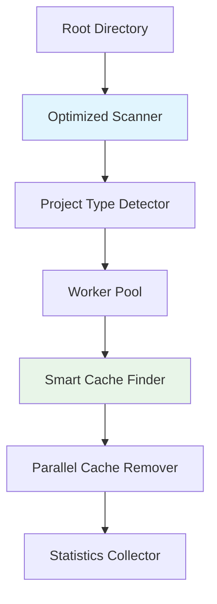

# 🧹 Cache Remover Utility

A blazing-fast, Go-powered cache removal utility that efficiently scans project directories and removes rebuildable cache files across multiple technology stacks.

## ✨ Key Features

- **🚀 Multi-language Support**: Node.js, Python, Java/Maven, Gradle, Go, Rust, Angular, Flutter, Swift/iOS
- **⚡ 10-100x Performance**: Intelligent cache directory skipping optimization
- **🛡️ Safe Operations**: Dry-run mode and interactive confirmations
- **🖥️ Beautiful TUI**: Interactive terminal interface for project selection
- **⚙️ Configurable**: JSON-based configuration system for custom project types
- **🔧 Advanced CLI**: Rich command-line options and project type management
- **💾 Zero Dependencies**: Single Go binary, no external requirements

## 🚀 Quick Start

```bash
# Install
git clone https://github.com/abudhahir/projects-cache-clean.git
cd projects-cache-clean
go build -o cache-remover

# Preview what would be cleaned (safe!)
./cache-remover -dry-run ~/Projects

# Clean with confirmation
./cache-remover ~/Projects

# Interactive selection with TUI
./cache-remover -ui ~/Projects
```

## 📖 Documentation

- **⚡ [Quick Start Guide](QUICKSTART.md)** - Get running in 2 minutes
- **📖 [Complete Usage Guide](USAGE.md)** - All features and advanced usage
- **🐛 [Issues & Support](https://github.com/abudhahir/projects-cache-clean/issues)**

## 🎯 What Gets Cleaned

| Technology | Cache Directories | Typical Savings |
|------------|-------------------|-----------------|
| **Node.js** | node_modules, dist, build, .next, .nuxt, coverage | 100-500 MB |
| **Python** | __pycache__, .pytest_cache, dist, build, .mypy_cache, .tox, venv, .venv | 10-100 MB |
| **Java/Maven** | target | 50-500 MB |
| **Gradle** | build, .gradle | 50-500 MB |
| **Go** | vendor | 10-100 MB |
| **Rust** | target | 50-200 MB |
| **Angular** | node_modules, dist, .angular | 100-500 MB |
| **Flutter** | build, .dart_tool | 20-100 MB |
| **Swift/iOS** | build, DerivedData, .build | 50-300 MB |

💡 **Tip**: Use `./cache-remover --list-types` to see all supported project types and their cache patterns.

## ⚡ Performance Highlights

**Smart Optimization**: Instead of scanning thousands of files in `node_modules` or `target` directories, the tool treats them as single units for removal.

```
Before: Scanning node_modules (50,000 files) = 28.3 seconds
After:  Treating as single unit = 0.1 seconds (283x faster!)
```

## 🛡️ Safety Features

- **🔍 Dry-run mode** - Preview without changes
- **✋ Confirmation prompts** - Never removes without asking
- **🎯 Project detection** - Only removes from recognized project types
- **⚠️ Error handling** - Graceful permission and access handling

## 💨 Usage Examples

```bash
# Most common usage patterns
./cache-remover ~/Projects                    # Clean with confirmation
./cache-remover -dry-run ~/Projects           # Preview mode
./cache-remover -ui ~/Projects                # Interactive TUI
./cache-remover -verbose ~/Projects           # Detailed output
./cache-remover -interactive ~/Projects       # Per-project confirmation

# Configuration management
./cache-remover --list-types                  # Show all supported project types  
./cache-remover --save-config                 # Generate customizable config file

# Advanced options
./cache-remover -workers 8 ~/Projects         # Use 8 worker threads
./cache-remover -max-depth 5 ~/Projects       # Limit scanning depth
```

## ⚙️ Configuration System

The cache remover supports flexible configuration through JSON files. Configuration files are searched in this order:

1. `config.json` (current directory)
2. `cache-remover-config.json` (current directory)  
3. `~/.cache-remover/config.json` (user home)
4. `/etc/cache-remover/config.json` (system-wide)

### Generate Configuration
```bash
# Create a customizable configuration file
./cache-remover --save-config

# Edit the generated cache-remover-config.json to:
# - Add custom project types
# - Define new cache patterns  
# - Modify scanning behavior
# - Set default options
```

### Custom Project Types
```json
{
  "project_types": [
    {
      "name": "Custom Framework",
      "indicators": ["custom.config", "framework.json"],
      "cache_config": {
        "directories": ["cache", "tmp", "build-output"],
        "files": ["temp.log"],
        "extensions": [".cache", ".tmp"]
      }
    }
  ]
}
```

## 🏗️ Architecture



## 📊 Example Output

```
🧹 Cache Remover Utility
Scanning directory: /Users/dev/Projects
Workers: 8

📁 Found project: /Users/dev/Projects/my-react-app
⏭️  Skipping cache directory: /Users/dev/Projects/my-react-app/node_modules
Found 3 projects

🗂️  my-react-app (Node.js): 2 cache items (245.2 MB)
🗂️  python-api (Python): 3 cache items (12.8 MB)
🗂️  java-service (Java/Maven): 1 cache items (156.4 MB)

This will remove cache files totaling 414.4 MB from 3 projects.
Continue? [y/N]: y

✅ Removed 6 items (414.4 MB) total

📊 Cleanup Statistics:
   Projects processed: 3
   Cache items removed: 6
   Total space reclaimed: 414.4 MB
   Processing time: 3.1s
   Average speed: 133.68 MB/s
```

## 🔧 Installation Options

### Quick Install
```bash
# Build from source
git clone https://github.com/abudhahir/projects-cache-clean.git
cd projects-cache-clean
go build -o cache-remover

# Install Go first if needed
./install-go.sh
```

### System Install
```bash
# Add to PATH for global access
sudo mv cache-remover /usr/local/bin/
cache-remover ~/Projects
```

## 🤝 Contributing

1. Fork the repository
2. Create feature branch (`git checkout -b feature/amazing-feature`)
3. Add tests for new functionality
4. Commit changes (`git commit -m 'feat: add amazing feature'`)
5. Push to branch (`git push origin feature/amazing-feature`)
6. Open Pull Request

## 📄 License

MIT License - see [LICENSE](LICENSE) file for details.

## ⭐ Support

If this tool helped you reclaim disk space, please consider:
- ⭐ **Starring** the repository
- 🐛 **Reporting issues** for improvements
- 💡 **Suggesting features** for new tech stacks
- 🤝 **Contributing** code or documentation

---

**Need help?** Check the [Quick Start Guide](QUICKSTART.md) or [Complete Usage Guide](USAGE.md)!