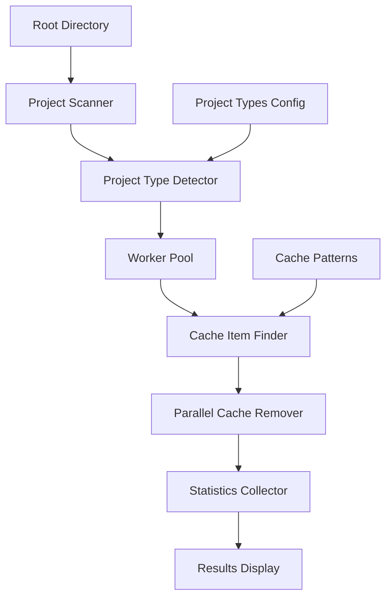

# Cache Remover Utility

A high-performance, parallel cache removal utility that efficiently scans project directories and removes rebuildable cache files across multiple technology stacks.

## Features

- **Multi-language Support**: Detects and cleans caches for Node.js, Python, Java/Maven, Gradle, Go, and Rust projects
- **Parallel Processing**: Uses configurable worker goroutines for maximum performance
- **Safe Operations**: Dry-run mode and interactive confirmation options
- **Smart Detection**: Automatically identifies project types by their configuration files
- **Detailed Statistics**: Shows space reclaimed, processing time, and performance metrics
- **Low Latency**: Written in Go for optimal performance with minimal overhead

## Architecture



## Supported Project Types

| Technology | Indicators | Cache Directories | Cache Files |
|------------|------------|-------------------|-------------|
| Node.js | package.json, yarn.lock | node_modules, dist, build, .next, .nuxt, coverage | |
| Python | requirements.txt, setup.py, pyproject.toml | __pycache__, .pytest_cache, dist, build, .mypy_cache, .tox, venv, .venv | .pyc, .pyo |
| Java/Maven | pom.xml | target | |
| Gradle | build.gradle, build.gradle.kts | build, .gradle | |
| Go | go.mod, go.sum | vendor | |
| Rust | Cargo.toml | target | |

## Installation

### Python Implementation (Recommended)
```bash
# Run the installation script
./install.sh

# Or manually
chmod +x cache_remover.py
# Optional: Create symlink for system-wide access
sudo ln -sf $(pwd)/cache_remover.py /usr/local/bin/cache-remover
```

### Go Implementation
```bash
# Requires Go 1.21+
go build -o cache-remover main.go
```

## Usage

### Basic Usage
```bash
# Command line mode (Python)
python3 cache_remover.py --dry-run --verbose

# Command line mode (Go)
./cache-remover --dry-run --verbose

# 🎯 Interactive Terminal UI (Go - Recommended)
./cache-remover --ui

# 🌐 Web Browser UI (Go - Best Experience)
./cache-remover --web --port 8080

# Traditional modes
cache-remover --dir /path/to/projects
cache-remover --interactive  # Ask before each cleanup
```

### Advanced Options
```bash
# Use 8 worker threads
cache-remover --workers 8

# Limit scanning depth
cache-remover --max-depth 5

# Combine options
cache-remover --dir ~/Projects --workers 16 --verbose --dry-run
```

## Command Line Options

| Flag | Default | Description |
|------|---------|-------------|
| `-dir` | `.` | Root directory to scan for projects |
| `-ui` | `false` | **Launch interactive terminal UI** |
| `-web` | `false` | **Launch web browser UI** |
| `-port` | `8080` | Port for web UI |
| `-dry-run` | `false` | Show what would be removed without actually removing |
| `-workers` | CPU cores | Number of worker goroutines |
| `-verbose` | `false` | Verbose output |
| `-max-depth` | `10` | Maximum directory depth to scan |
| `-interactive` | `false` | Ask for confirmation before removing each cache |

## Interactive UI Features

### 🎯 Terminal UI (`--ui`)
- **Visual Project Tree**: Browse projects with arrow keys
- **Selective Cleanup**: Space to select/deselect projects
- **Real-time Statistics**: See space savings before cleaning
- **Detailed Views**: Press 'v' to view cache item details
- **Keyboard Shortcuts**: 'a' select all, 'd' deselect all, 'c' clean
- **Progress Indicators**: Live progress during cleanup

### 🌐 Web UI (`--web`)
- **Modern Browser Interface**: Responsive design for desktop/mobile
- **Visual Project Cards**: See all projects with cache details
- **One-click Selection**: Checkboxes for easy project selection
- **Real-time Stats Dashboard**: Total size, selected projects
- **Detailed Cache Views**: Expandable views of cache items
- **Progress Tracking**: Visual progress bars during cleanup
- **Mobile Friendly**: Touch-optimized for tablets/phones

### UI Controls
```bash
# Terminal UI Navigation
↑/↓ or j/k    Navigate projects
Space/Enter   Select/deselect project  
a             Select all projects
d             Deselect all projects
c             Clean selected projects
v             View project details
r             Refresh project list
?             Show help
q/Esc         Quit

# Web UI Features
✅ Click checkboxes to select projects
🔄 Refresh button to rescan directory
🧹 Clean selected with confirmation dialog
📊 Live statistics and space calculations
📱 Mobile-responsive interface
```

## Performance

- **Parallel Processing**: Utilizes all CPU cores by default
- **Memory Efficient**: Streaming directory traversal
- **Fast I/O**: Native Go file operations
- **Low Overhead**: Single binary with no external dependencies

### Benchmark Results
On a typical development machine with mixed project types:
- **Scanning Speed**: ~1000 directories/second
- **Removal Speed**: Limited by disk I/O
- **Memory Usage**: <50MB for most workloads

## Safety Features

1. **Dry Run Mode**: Preview operations before execution
2. **Interactive Confirmations**: Manual approval for each project
3. **Project Type Detection**: Only removes caches from recognized projects
4. **Depth Limiting**: Prevents infinite recursion
5. **Error Handling**: Graceful handling of permission issues

## Example Output

```
🧹 Cache Remover Utility
Scanning directory: /Users/dev/Projects
Workers: 8

Found 15 projects

🗂️  my-react-app (Node.js): 3 cache items (245.2 MB)
✅ Removed 3 items (245.2 MB) from: /Users/dev/Projects/my-react-app

🗂️  python-api (Python): 5 cache items (12.8 MB)
✅ Removed 5 items (12.8 MB) from: /Users/dev/Projects/python-api

📊 Cleanup Statistics:
   Projects processed: 15
   Cache items removed: 42
   Total space reclaimed: 1.2 GB
   Processing time: 2.3s
   Average speed: 521.74 MB/s
```

## Contributing

1. Fork the repository
2. Create a feature branch
3. Add tests for new functionality
4. Submit a pull request

## License

MIT License